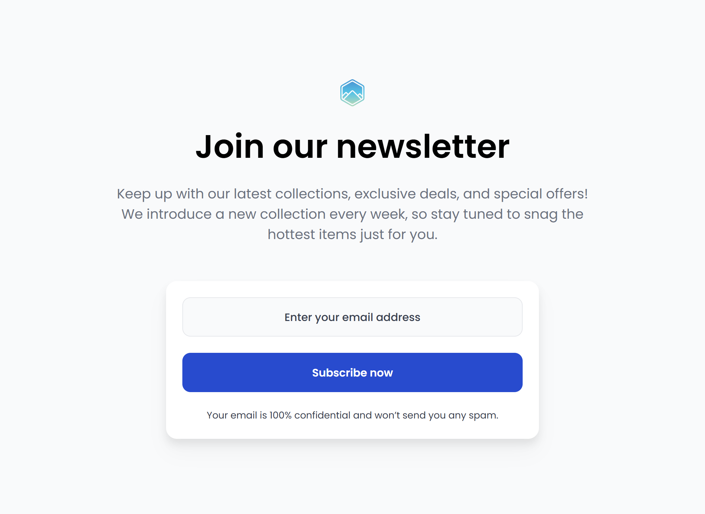

<h1 align="center">Join Our Newsletter | devChallenges</h1>

   Solution for a challenge <a href="https://devchallenges.io/challenge/join-our-newsletter" target="_blank">Join Our Newsletter</a> from <a href="http://devchallenges.io" target="_blank">devChallenges.io</a>.

  <h3>
    <a href="https://g-akca.github.io/dc-join-our-newsletter/">
      Demo
    </a>
     | 
    <a href="https://github.com/g-akca/dc-join-our-newsletter">
      Solution
    </a>
     | 
    <a href="https://devchallenges.io/challenge/join-our-newsletter">
      Challenge
    </a>
  </h3>

## Table of Contents

- [Overview](#overview)
- [Built with](#built-with)
- [Features](#features)
- [Contact](#contact)

## Overview

### Built with

- Semantic HTML5 markup
- CSS custom properties
- Flexbox
- Mobile-first workflow
- Media queries

## Features

This application/site was created as a submission to a [DevChallenges](https://devchallenges.io/challenges-dashboard) challenge.

## Author

- GitHub: [@g-akca](https://{github.com/g-akca})
- devChallenges: [@g-akca](https://devchallenges.io/profile/ef372c5e-cfc9-417d-8266-5cc25cd52850)